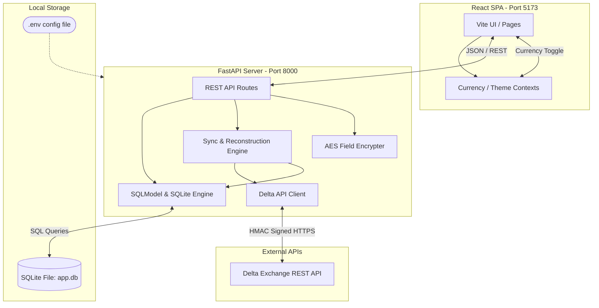
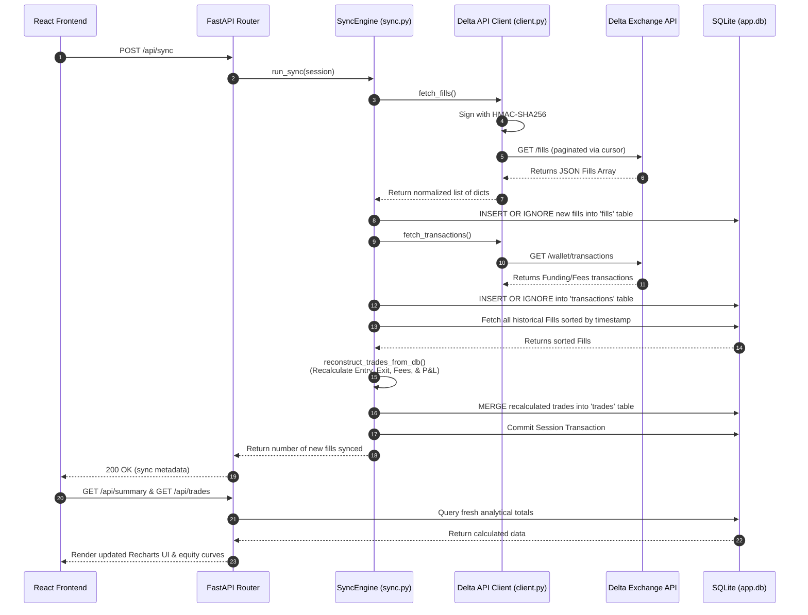

# Delta Journal - Master Knowledge Base & Architecture Guide

Welcome to the **Delta Journal** technical knowledge base. This master document provides a comprehensive analysis of the system architecture, core modules, data flows, and developer onboarding pathways. It is designed to act as an educational, high-density reference for any engineer working on the project.

---

## Table of Contents
1. [System Architecture & High-Level Overview](#1-system-architecture--high-level-overview)
   - [Directory Structure & Entry Points](#directory-structure--entry-points)
   - [Core Technology Stack](#core-technology-stack)
   - [System Context & Diagram](#system-context--diagram)
2. [Core Modules & Data Flows](#2-core-modules--data-flows)
   - [Critical Subsystems](#critical-subsystems)
   - [Primary Data Flow](#primary-data-flow)
   - [Trade Sync Sequence Diagram](#trade-sync-sequence-diagram)
3. [Developer Onboarding & Architectural Hardening](#3-developer-onboarding--architectural-hardening)
   - [Setup & Installation Guide](#setup--installation-guide)
   - [Production-Grade Gotcha Fixes & Architectural Security](#production-grade-gotcha-fixes--architectural-security)

---

## 1. System Architecture & High-Level Overview

Delta Journal is a secure, automated cryptocurrency trading journal specifically tailored for Delta Exchange. It provides a real-time, local React Single-Page Application (SPA) paired with a FastAPI JSON backend service.

### Directory Structure & Entry Points

```text
journal/
├── app/                        # Main Application Directory
│   ├── backend/                # Python-based FastAPI Backend
│   │   ├── api/                # Core API Subpackage
│   │   │   ├── client.py       # Delta Exchange API Client (with retry, backoff & parse drift)
│   │   │   ├── config.py       # Configuration and .env loader
│   │   │   ├── database.py     # SQLite and SQLModel Connection & Programmatic Auto-Migrations
│   │   │   ├── encryption.py   # Secure AES-128 Fernet & PBKDF2 Field Encryption
│   │   │   ├── models.py       # SQLModel Table Schema definitions
│   │   │   ├── routes.py       # REST API endpoint definitions (with transit encryption decrypt/encrypt)
│   │   │   └── sync.py         # Synchronization & average-cost trade calculation engine
│   │   ├── static/             # Static assets, e.g., screenshot directories
│   │   ├── tests/              # Backend test suite (verifying encryption, parser fallback, etc.)
│   │   ├── background_sync.py  # Background sync script running every 5 seconds
│   │   ├── main.py             # FastAPI App Entry point & Uvicorn runner
│   │   ├── pyproject.toml      # uv-compatible Python dependency configuration
│   │   └── uv.lock             # Dependency lock file for Python
│   └── frontend/               # React + TypeScript Frontend
│       ├── src/                # Frontend Source
│       │   ├── App.tsx         # Main UI shell, routing, global state, layout
│       │   ├── components/     # Reusable UI Widgets (Sidebar, Modal, Calendar, etc.)
│       │   ├── config/         # API Endpoint Constants
│       │   ├── hooks/          # Global context hooks (useCurrency, useTheme)
│       │   ├── pages/          # Layout Pages (Dashboard, Analytics, Safety, etc.)
│       │   └── utils/          # Visual theme variables & error normalization
│       ├── package.json        # Node.json / Bun package descriptors
│       └── vite.config.ts      # Vite configuration for building assets
├── docker-compose.yml          # Container configuration for both backend and frontend
├── start.sh                    # Full-stack runner starting backend, frontend, and sync loops
└── AGENTS.md                   # Instructions and guidelines for AI coding agents
```

### Core Technology Stack

#### A. Frontend (`app/frontend/`)
- **Framework**: React 18 with TypeScript.
- **Build System**: Vite.
- **Styling**: Tailwind CSS v4 (native CSS-first styling).
- **Visualization**: Recharts (for responsive trade curves, P&L distributions, and drawdowns).
- **Icons**: Lucide React.
- **Package Manager**: Bun (enforced by user rules).

#### B. Backend (`app/backend/`)
- **Framework**: FastAPI (asynchronous ASGI framework).
- **Server**: Uvicorn.
- **Database Engine**: SQLite 3 with Write-Ahead Logging (WAL) and busy timeout handles.
- **ORM & Validation**: SQLModel (synthesizes SQLAlchemy ORM capabilities with Pydantic schemas).
- **Security & Encryption**: Cryptography package (AES-128 Fernet with PBKDF2-SHA256 key derivation).
- **Package Manager**: `uv` (Astral's high-speed package installer).

### System Context & Diagram

Below is the high-level representation of how the React Frontend, FastAPI Backend, SQLite Database, and Sync Engine interact with the external Delta Exchange API:



---

## 2. Core Modules & Data Flows

### Critical Subsystems

The Delta Journal repository relies on 7 critical subsystems:

#### 1. Delta API client (`app/backend/api/client.py`)
- **Purpose**: Authenticated HTTPS interfacing with Delta Exchange endpoints.
- **Security & Integrity**: Automatically generates HMAC-SHA256 request signatures using `api-key` and `signature` headers. Never transmits API keys or secrets in URI query strings or request bodies.
- **Resilience**: Implements automatic exponential backoff on retry-friendly HTTP codes (429, 500, 502, 503, 504) and automatically compensates for time-drift failures.
- **Error Boundaries**: Provides `DeltaAPIError`, which strips credential headers from all exception messages and stack traces to prevent sensitive leaks in system logs.

#### 2. Trade Reconstruction & Matching Engine
- **Web App Engine (`app/backend/api/sync.py`)**: Uses a non-destructive state reconstruction loop. Fetches all fills and maps active net position metrics per trading symbol in memory. On partial exits, it calculates realized P&L based on the **average entry cost** (`current_notional / current_size`), and updates target columns.

#### 3. Indian Speculative Business Tax & Compliance
- **Speculative Income Slab Tax**: Tracks derivative trading gains. In Indian taxation, crypto futures are classified as speculative business income rather than Virtual Digital Assets (VDA) spot transfers. Consequently, net gains are taxed at the trader's individual standard tax slab (e.g. standard slab rates up to 30%), and speculative losses can be carried forward up to 4 years to offset future speculative gains.
- **Turnover Audit Tracking**: Standard turnover calculations do not work for futures. Turnover is calculated using `abs(gross_pnl)` on a trade-by-trade basis. This aggregate sum is vital for determining if a trader exceeds the ₹10 Crore tax audit threshold.
- **GST Extraction**: Delta Exchange fees contain an integrated 18% GST (embedded directly within the returned commission). The engine parses base fees and displays GST separately using the formula:
$$\text{GST} = \text{Commission} \times \frac{18}{118}$$

#### 4. Cryptographic Storage & Concurrency
- **AES-128 Column Encryption**: Integrated inside `app/backend/api/encryption.py`, executing transparent symmetric encryption/decryption on sensitive journal notes, lesson files, strategic parameters, and emotional logs. Fallback parsing ensures plain-text compatibility.
- **High Concurrency WAL Engine**: SQLite integration configured with an explicit 30-second busy timeout and Write-Ahead Logging active, eliminating concurrency exceptions.

#### 5. Funding Cost & Reward Optimization Engine
- **Asset breakdown matrix**: Tracks and displays transaction commission fees, net funding payouts, voucher earnings, and net cash flow performance mapped directly by trading asset (e.g., USDT, BTC, ETH).
- **Leakage Alert Diagnostics**: Monitors adverse funding rate events and high commissions, flagging warning cards detailing the asset, severity level, specific cost leakage, and actionable remedies (e.g., avoiding multi-day leveraged hold intervals during funding clocks or opting for maker order limits).

#### 6. Live Orderbook Depth & Execution Overlay
- **Bids/Asks Market Ladder**: Displays real-time order depth with custom-rendered color liquidity fills (red for asks, green for bids) and dynamic spread calculation metrics.
- **Execution Overlay**: Maps average entry and average exit parameters contextually onto the active market depth to help traders audit slippage and locate their position entry/exit points visually.

#### 7. API Rate Limit Health Widget
- **Live Rate Indicator**: Decodes rate limits, remaining quota allocations, and time resets from public exchange nodes to safeguard against rate exhaustions.
- **Visual Progress Bar**: Integrated dynamically inside the connection panel, transitioning from green to red when rate pools are close to depletion.

### Primary Data Flow

#### Data Sync Workflow (Fetch → Reconstruct → Render)
1. **Traded executions** are generated on Delta Exchange.
2. The sync service (`background_sync.py` or a manual UI button) triggers a fetch request.
3. The API client pulls paginated JSON elements from `/fills` and `/wallet/transactions`.
4. Raw data is validated as `APIFill` Pydantic models.
5. Fills are committed as immutable database logs in the SQLite table `fills`.
6. The matching engine queries SQLite, computes open stacks in memory, and writes matched trade records into `trades`.
7. The React SPA fetches `/summary` and `/trades` and renders responsive React charts.

### Trade Sync Sequence Diagram



---

## 3. Developer Onboarding & Architectural Hardening

### Setup & Installation Guide

#### 1. Core Prerequisites
Ensure you have the following package managers installed:
- **Python Package Manager**: `uv` (Required by rules).
- **TypeScript Runtime**: `bun` (Required by rules).
- **Local Database**: `sqlite3`.

#### 2. Configuration Setup
Create a `.env` file in the project's root folder:
```bash
# Copy template
cp .env.example .env
```
Fill out the variables:
- `DELTA_API_KEY`: Read-only API key generated from the Delta Exchange dashboard.
- `DELTA_API_SECRET`: Corresponding read-only API secret (also used securely for database PBKDF2 salt and encryption).
- `GEMINI_API_KEY`: API token from Google AI Studio.
- `DELTA_REGION`: Set to `india` (default) or `global`.
- `WEBHOOK_URL`: Optional Discord/Slack webhook for large P&L alert broadcasts.
- `PNL_ALERT_THRESHOLD`: Triggers webhook alert if trade profit/loss exceeds this absolute value (default: `100.0` USD).

#### 3. Starting the Full-Stack Application
Simply run the shell orchestrator at the root level. This script automatically starts the backend API, spins up the auto-sync daemon in the background, installs frontend dependencies via Bun (if missing), and launches the Vite React dev server:
```bash
chmod +x start.sh
./start.sh
```

#### 4. Executing Tests
To run unit and integration tests:
```bash
cd app/backend
PYTHONPATH=. uv run pytest tests/ -v
```

---

### Production-Grade Gotcha Fixes & Architectural Security

#### Gotcha 1: Concurrency locks & SQLite WAL mode
- **Problem**: Rapid background sync routines (every 5 seconds) and user dashboard updates are vulnerable to SQLite "Database is locked" exceptions.
- **Remedy**: Configured an engine-wide `timeout=30.0` connection parameter and activated Write-Ahead Logging (WAL) mode (`PRAGMA journal_mode=WAL`). Multiple read loops query SQLite concurrently without blocking active writes.

#### Gotcha 2: On-Disk Security of Personal Data
- **Problem**: While API credentials are safe in the `.env` context, user observations, lessons, trading psychological profiles, and review notes are traditionally stored as unencrypted plain text.
- **Remedy**: Implemented automated, column-level symmetric AES-128 Fernet encryption derived securely from the user's `DELTA_API_SECRET` via `PBKDF2HMAC`. Endpoints automatically encrypt on write and decrypt on read, with full backwards-compatible plain-text fallback handling.

#### Gotcha 3: Diverse Delta Timestamp parsing
- **Problem**: Delta Exchange returns transaction times as both Unix microsecond integers (e.g. `1678045806327000`) and standard ISO-8601 strings (e.g. `2026-05-22T23:46:16.000Z`), causing drift-induced parser crashes.
- **Remedy**: Developed a standardized unified parser `parse_delta_timestamp` that intercepts both string-based and numeric formats, dynamically resolving microsecond or millisecond epochs safely.

#### Gotcha 4: Dynamic Table Auto-Migrations
- **Problem**: Boot-time database checks traditionally require manually maintained tables of SQL strings, risking database drift as codebase models change.
- **Remedy**: Built an automated SQLAlchemy table-alignment inspection system that compares defined `SQLModel` structures with live SQLite tables, dynamically executing non-destructive `ALTER TABLE` operations to keep schemas synchronized.
